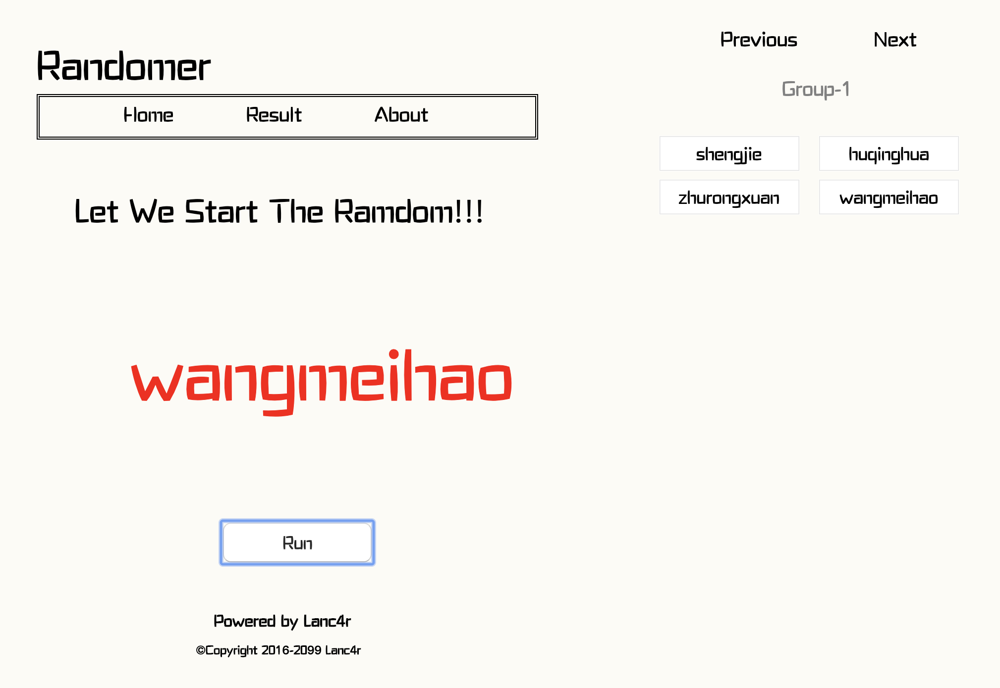

# Have A Roll

一款简易的抽奖小程序

## 简介

两年前给同学写的小工具被我翻了出来，做了简单的修改，所以它目前也只有简单的功能(是真的很简单，后续进行优化把 Orz..)

## 后续优化

不知道什么时候，先记着吧，无聊的时候就可以写写

### 功能相关
- 支持多个数据同时随机
- 支持为分组设置名称
- 支持选择是否重复抽取数据
- 支持图片随机抽取
- 支持多中数据导入方式
- 支持导出持久化存储(高级姿势)
- 支持中奖数据分析(高级姿势)

### 其他优化
- 代码优化
- UI优化

## 输出效果

