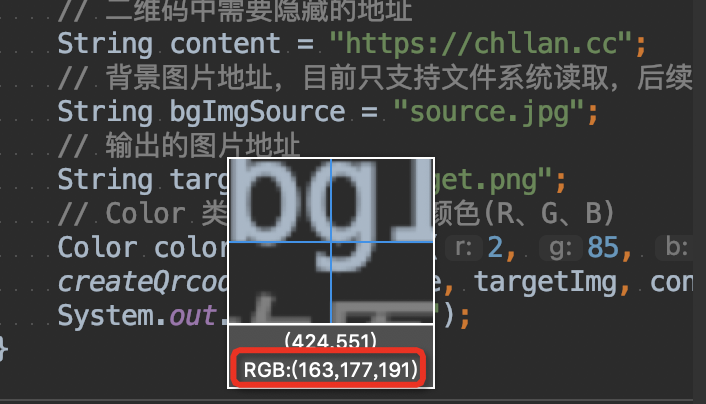

# ImageLoveQrCode

生成自定义图片背景的二维码，调用方法 createQrcode(String bgImgSource, String targetImg, String content, Color color)

## createQrcode() 参数介绍

- bgImgSource —— 背景图片地址
- targetImg —— 输出的目标图片地址
- content —— 二维码藏的内容
- color —— 指定二维码绘制的颜色

## Color 参数

Color 参数需要传入三原色(R、G、B)，这里讲一个获取三原色的简单方法吧，随便打开一个截图工具，让你吧光标放到指定颜色上的时候就会显示当前选中颜色的 RGB 属性了：

## 依据类

[visual-qr-code](https://gitee.com/boat824109722/visual-qr-code)

## 输出效果

